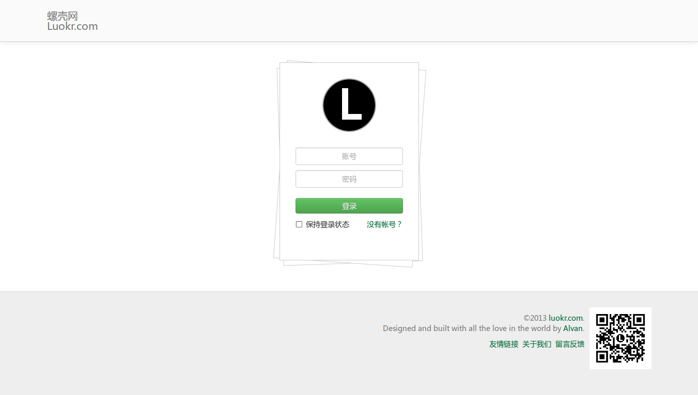
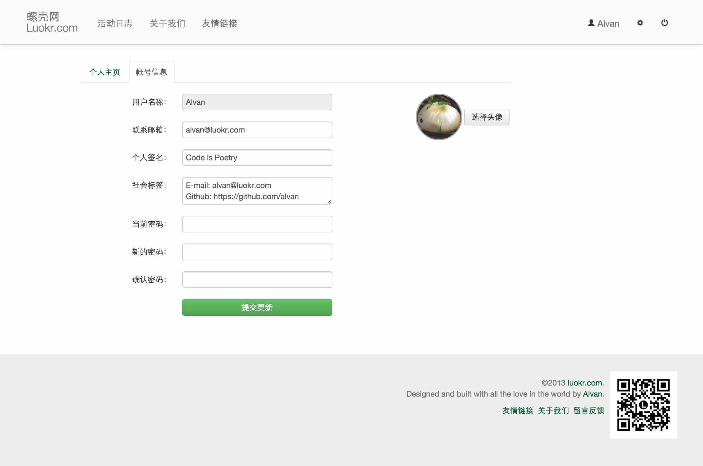
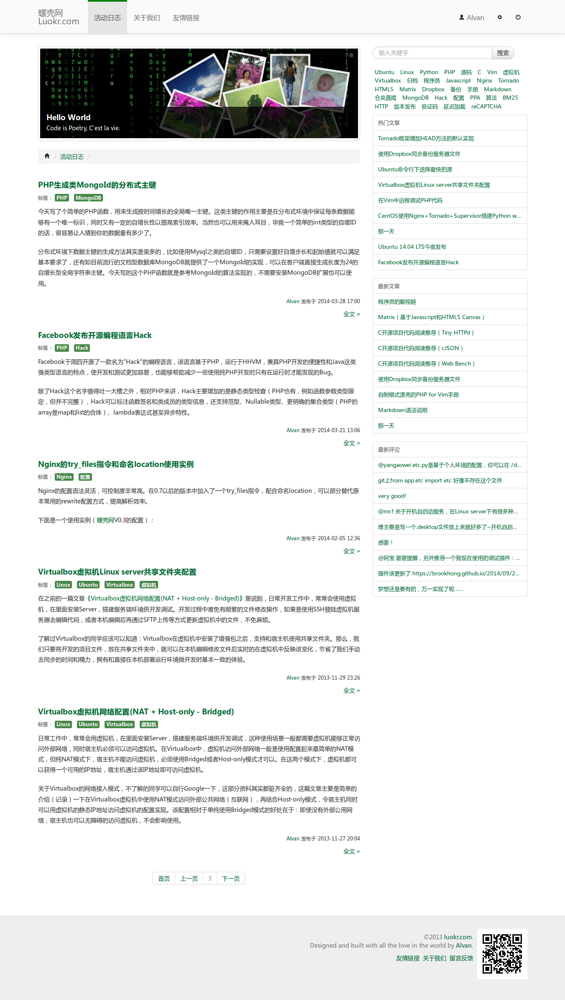
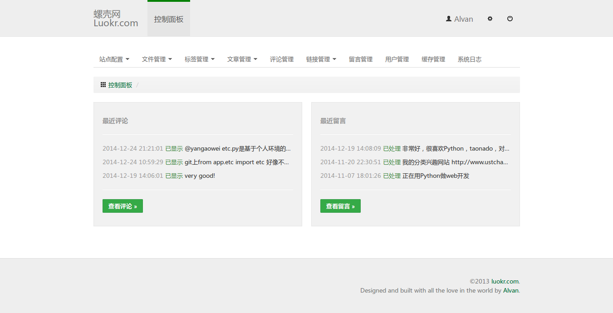
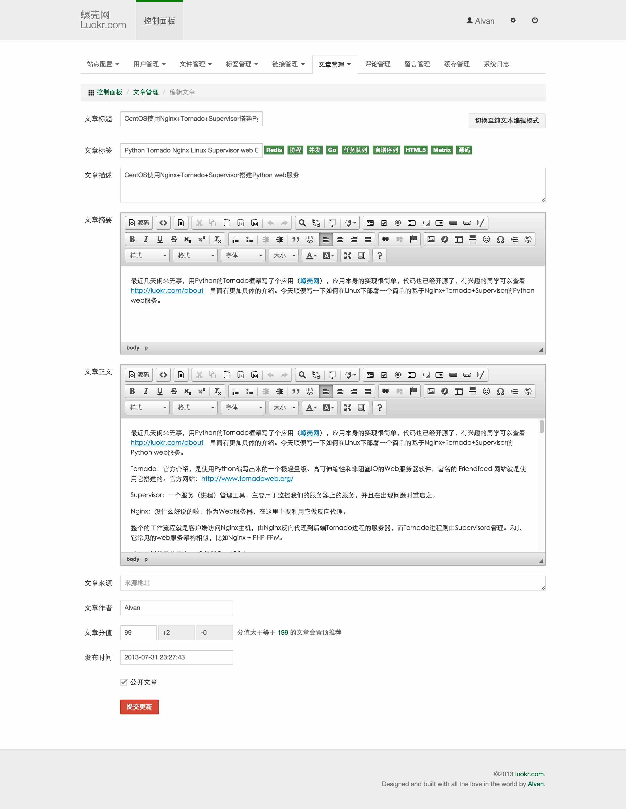

luokr.com
=========

The initial version of luokr.com was developed by [Alvan](http://luokr.com/@Alvan) in July 2013. It is a Python-based server application using Tornado framework at backend and Bootstrap framework at frontend.
Now it just a simple blog about technology and life.

Below is the main directory structure:

    luokr.com
    ---- app/
    -------- etc.py     # configuration file, see `../doc/etc.py.sample` for more details
    -------- svr.py     # to start the app, run `python svr.py`
    -------- url.py     # url mapping
    -------- ctrls/     # controllers, see Tornado's RequestHandler
    -------- datum/     # datum class files
    -------- model/     # model class files
    -------- tools/     # some tools, run `python tools/dbase.py` to make databases.
    -------- views/     # templates
    ---- doc/           # documents
    ---- lib/           # libraries
    ---- var/           # variables
    -------- datas/     # databases
    ---- www/           # web root, static files

The background landing address is `/admin`, default username is `admin` and password is `123456`.
You can change it after you logined.

Requirement
------------

(Python >= 2.7)

* tornado (>= 4.3)
* pil or pillow

Screenshots
-----------
* About

* Login

* Shell

* Posts

* Admin

* Admin (Edit Post)

